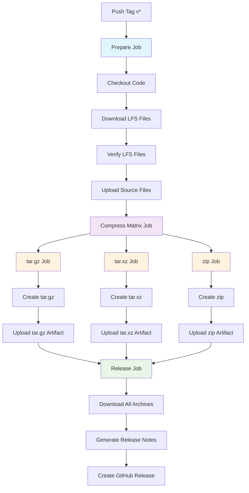

# 如何创建包含完整内容的Release

## 自动化Release流程

本项目配置了GitHub Action，可以在创建tag时自动生成包含完整LFS内容的Release。

### 使用方法

1. **创建并推送tag：**
   ```bash
   git tag v1.0.0
   git push origin v1.0.0
   ```

2. **Action会自动：**
   - **准备阶段**: 检出代码并下载所有LFS文件，验证LFS文件
   - **并行压缩阶段**: 使用矩阵策略同时创建tar.gz、tar.xz、zip三种格式
   - **发布阶段**: 收集所有压缩包，生成Release notes，创建GitHub Release

### 生成的文件

- `steam-bootstraplinux-v1.0.0-complete.tar.gz` - 完整包（标准压缩）
- `steam-bootstraplinux-v1.0.0-complete.tar.xz` - 完整包（最高压缩率，推荐）
- `steam-bootstraplinux-v1.0.0-complete.zip` - 完整包（Windows友好）
- Source Code (zip) - 仅包含指针文件
- Source Code (tar.gz) - 仅包含指针文件

**注意：** 所有完整包都只包含 `bootstraplinux_ubuntu12_32` 目录的内容，不包含目录层级。

### Tag命名规范

Action会在推送以 `v` 开头的tag时触发，建议使用语义化版本：

- `v1.0.0` - 主要版本
- `v1.0.1` - 修复版本
- `v1.1.0` - 次要版本
- `v2.0.0-beta.1` - 预发布版本

### 手动创建Release

如果需要手动创建Release：

```bash
# 确保LFS文件已下载
git lfs pull

# 进入目标目录
cd bootstraplinux_ubuntu12_32

# 创建完整包（不包含目录层级）
tar -czf ../steam-bootstraplinux-complete.tar.gz .         # 标准压缩
tar -cJf ../steam-bootstraplinux-complete.tar.xz .          # 最高压缩
zip -r -9 ../steam-bootstraplinux-complete.zip .           # ZIP格式

# 返回上级目录
cd ..

# 上传到GitHub Release
```

### 工作流程图



### 并行压缩优势

新的矩阵策略带来以下优势：
- **速度提升**: 三种格式同时压缩，而不是串行处理
- **资源优化**: 每个压缩任务使用独立的runner
- **失败隔离**: 单个格式失败不会影响其他格式的创建
- **可扩展性**: 可以轻松添加新的压缩格式

### 故障排除

1. **Action失败：**
   - 检查仓库是否启用了LFS
   - 确保所有LFS文件都已正确推送
   - 查看具体哪个阶段失败（准备/压缩/发布）

2. **文件大小异常：**
   - 验证LFS文件不是指针文件
   - 检查LFS存储配额

3. **权限问题：**
   - 确保仓库设置中启用了Actions写入权限
   - 检查GITHUB_TOKEN权限

4. **压缩阶段失败：**
   - 检查矩阵中的特定格式是否有问题
   - 验证压缩命令是否正确执行

### 监控Action状态

- 访问仓库的 Actions 页面查看工作流状态
- 在 Releases 页面查看生成的Release
- 查看Action日志了解详细信息 